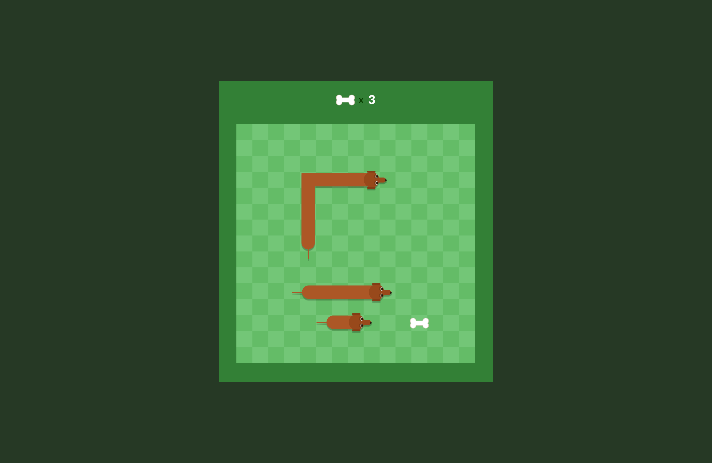

# Choice of Game: SNAKE (Dachshund as a character)

# Wireframe

https://www.figma.com/file/lOJ2dlLjrZpje13gi3NXQi/Dachshund-Game-(Snake)?type=design&node-id=0%3A1&mode=design&t=Zufn8p0i9zKF93FT-1

# App's functionality

- As a SE, I want the game to end when the player hits the wall or bites the body.
- As a SE, I want the treats to be placed randomly on the screen
- As a player, I want to guide the dog to eat the treat so it can grow longer.
DONE - As a player, I want to control the character using the keyboard arrow. 
- As a player, I want to have my score visibile above the grid.
- As a player, I want to play again after winning or losing.
- As a SE, I want the user to win when there is not more room for the dog to grow.

ICEBOX
- As a aplayer, I want to be shown a count down to the start of the game.
- As a player, I want the dog to move faster each time it eats so it can fill up the space available.
- As a player, I want to select which dog I want to play with (Tyler of Taylor).

* Rules
  * Do not let the dog hit a wall
  * Do not let the dog bite its own body
  * Your score is calculated based on the number of treats you eat

* Win/Lose
  * Win - You win the game when there is no more room for the dog to grow
  * Lose - You lose the game if the dog bites its body or hit a wall

# Pseudocode 

$ Player clicks on a button to start the game 
  ICEBOX - There will be a countdown (3, 2, 1)
  DONE - The dog starts moving

$ Player uses the keyboard to navigate the dog towards the treat
  DONE - Up, Down, Left, Right
  
$ Set boundaries - walls, dog body and backwards movements

$ Check if the dog hit a wall or bite itself (every time before each movement on the grid)
  - Game over 
      * bite itself or hit the wall
      * Show the button Play Again -> a new game starts
      * 
$ Display treats on the grid based on random location
  
$ Allow the dog to eat the treats
  - Treats disappear, and reappear on a random location
  - Updates the score -> treat count increases on the board
  
  
  